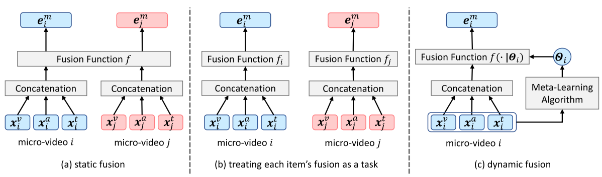
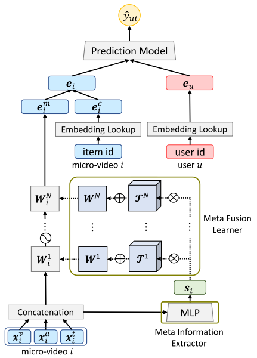
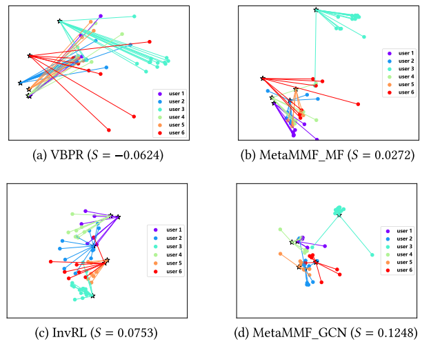
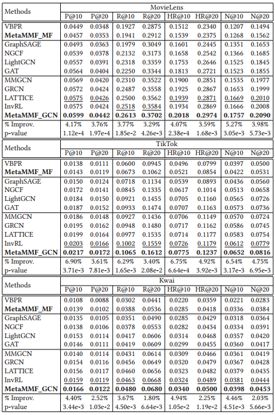

# Dynamic Multimodal Fusion via Meta-Learning Towards Micro-Video Recommendation

> The official implementation of MetaMMF, a meta-learning-based framework for dynamic multimodal fusion in micro-video recommendation.

## Authors

**Han Liu**<sup>1</sup>, **Yinwei Wei**<sup>2</sup>, **Fan Liu**<sup>2</sup>, **Wenjie Wang**<sup>2</sup>, **Liqiang Nie**<sup>3</sup>\*, **Tat-Seng Chua**<sup>2</sup>

<sup>1</sup> Shandong University  
<sup>2</sup> National University of Singapore  
<sup>3</sup> Harbin Institute of Technology (Shenzhen)  
\* Corresponding author

## Links

- **Paper**: [ACM TOIS 2024](https://doi.org/10.1145/3617827)
- **Code Repository**: [GitHub](https://github.com/hanliu95/MetaMMF)

---

## Table of Contents

- [Updates](#updates)
- [Introduction](#introduction)
- [Highlights](#highlights)
- [Method / Framework](#method--framework)
- [Project Structure](#project-structure)
- [Installation](#installation)
- [Dataset / Benchmark](#dataset--benchmark)
- [Usage](#usage)
- [Demo / Visualization](#demo--visualization)
- [Citation](#citation)
- [Acknowledgement](#acknowledgement)
- [License](#license)

---

## Updates

- **[11/2023]** The paper has been officially published in ACM Transactions on Information Systems (TOIS), Volume 42, Issue 2.
- **[12/2022]** Initial release of the official code and toy dataset for MetaMMF.

---

## Introduction

This repository provides the official implementation for the paper **"Dynamic Multimodal Fusion via Meta-Learning Towards Micro-Video Recommendation"**.

Existing multimodal recommendation models typically employ *static* multimodal fusion, assuming that information from the same modality plays a similar role across all items. However, in micro-video recommendation, the relationships among modalities (visual, acoustic, textual) can vary significantly from one video to another. 

To address this, we present **Meta Multimodal Fusion (MetaMMF)**, a framework that treats the multimodal fusion of each micro-video as an independent task. By leveraging meta-learning, MetaMMF dynamically assigns parameters to the multimodal fusion function for each item based on its unique multimodal features. This repository provides the model training and testing scripts, alongside implementations of MetaMMF combined with standard collaborative filtering (MF) and Graph Convolutional Networks (GCN).

---

## Highlights

- **Dynamic Multimodal Fusion**: Employs a meta-learner to dynamically parameterize item-specific fusion functions, overcoming the limitations of static static fusion strategies.
- **Model-Agnostic Design**: Seamlessly integrates with conventional representation learning models like Matrix Factorization (MetaMMF_MF) and Graph Convolutional Networks (MetaMMF_GCN).
- **High Efficiency**: Utilizes Canonical Polyadic (CP) Decomposition to dramatically reduce the parameters of the 3-D weight tensors, improving training efficiency and convergence speed.
- **State-of-the-Art Performance**: Achieves significant improvements over competitive baselines (e.g., MMGCN, LATTICE, InvRL) on benchmark datasets including MovieLens, TikTok, and Kwai.

---

## Method / Framework

MetaMMF extracts meta information from the multimodal features of the input item via a Multi-Layer Perceptron (MLP). Based on this meta information, a meta fusion learner dynamically parameterizes a neural network to serve as the item-specific fusion function. The joint representation can then be fed into a prediction model like MF or GCN.

<br>
**Figure 1.** Illustration of the static and the dynamic multimodal fusion.

<br>
**Figure 2.** Schematic illustration of the overall MetaMMF framework.

---

## Project Structure

```text
.
├── assets/ 
├── dataset_sample/            # Toy datasets for validation
│   └── movielens/
│       ├── a_feat_sample.npy            # Acoustic features
│       ├── t_feat_sample.npy            # Textual features
│       ├── v_feat_sample.npy            # Visual features
│       └── user_item_dict_sample.npy    # User-item interactions
├── cpd_layer.py               # Simplified layer using CP Decomposition
├── data_load.py               # Script to load and preprocess raw data
├── data_triple.py             # Script to generate training triplets
├── Fusion_model.py            # Implementation of the MetaMMF framework
├── GCN_model.py               # Implementation of MetaMMF_GCN
├── meta_layer.py              # Regular layer implementation for MetaMMF
├── model_test.py              # Evaluation script
├── model_train.py             # Training script
├── README.md
└── LICENSE
```
---

## Installation

### 1. Clone the repository

```bash
git clone [https://github.com/hanliu95/MetaMMF.git](https://github.com/hanliu95/MetaMMF.git)
cd MetaMMF
```

### 2. Environment Settings

The code has been tested under the following environment:

* Python 3.7
* Pytorch 1.7.0+cu101
* PyTorch Geometric 1.7.2
* Numpy 1.19.5
* Pandas 1.3.5

You can install the core dependencies via pip:

```bash
pip install torch==1.7.0+cu101 torchvision==0.8.1+cu101 torchaudio==0.7.0 -f [https://download.pytorch.org/whl/torch_stable.html](https://download.pytorch.org/whl/torch_stable.html)
pip install torch-geometric==1.7.2 numpy==1.19.5 pandas==1.3.5
```

---

## Dataset / Benchmark
Please check [MMGCN](https://github.com/weiyinwei/MMGCN) for the datasets: Kwai, Tiktok, and Movielens.

Due to the copyright, we could only provide some toy datasets for validation. If you need the complete ones, please contact the owners of the datasets.

---

## Usage

Please follow this exact execution sequence to train and test the model using the provided sample dataset.

### Data Preparation
Load the raw data and generate the triplets required for pairwise BPR loss optimization:
```bash
python data_load.py
python data_triple.py
```

### Training

Start the model training process:
```bash
python model_train.py
```
During execution, the script will output the training loss:
```text
[1, 500] loss: 0.21953
[1, 1000] loss: 0.15628
...
```

### Evaluation
Once training is complete, evaluate the model performance on the test set:
```bash
python model_test.py
```
Expected output format for MetaMMF_GCN:
```text
P@10: 0.0599; R@10: 0.2613; HR@10: 0.2018; NDCG@10: 0.1757
```

## Demo / Visualization

### Example Results

Our dynamic multimodal fusion strategy leads to a highly discriminative embedding space, capturing fine-grained user-item correlations better than traditional static methods.
<br>
**Figure 3.** t-SNE visualization comparing the representations obtained by VBPR, InvRL, and our MetaMMF models.

<br>
**Table 1.** Overall Performance Comparison between our Model and the Baselines on Three Datasets

## Citation
If you find this work helpful in your research, please consider citing our paper:
```bibtex
@article{liu2023dynamic,
  title={Dynamic multimodal fusion via meta-learning towards micro-video recommendation},
  author={Liu, Han and Wei, Yinwei and Liu, Fan and Wang, Wenjie and Nie, Liqiang and Chua, Tat-Seng},
  journal={ACM Transactions on Information Systems},
  volume={42},
  number={2},
  pages={1--26},
  year={2023},
  publisher={ACM New York, NY, USA}
}
```

## Acknowledgement

This work is supported by the National Natural Science Foundation of China (No. U1936203) and the program of China Scholarship Council (No. 202106220122). We also thank the open-source community for providing excellent tools and baselines.

## License

This project is released under the standard open-source license. Please see the LICENSE file for more details.
